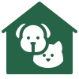

<a id='readme-top'> </a>

<br />
<div align="center">
  
  <a href="https://github.com/SA-BlueOcean/PetCentral">
    <!-- TODO: Create an LOGO for PetCentral -->
    <!--  -->
  </a>
  <h3 align="center">
    PetCentral
  </h3>
  <p align="center">
    <a href="https://pet-central.vercel.app/">View Live</a>
    |
    <a href="https://github.com/SA-BlueOcean/PetCentral/issues">Report Bug</a>
    |
    <a href="https://github.com/SA-BlueOcean/PetCentral/issues">Request Feature</a>

  </p>
</div>

<details>
  <summary>Table of Contents</summary>
  <ol>
    <li>
      <a href="#about">About</a>
      <ul>
        <li>
          <a href="#built-with">Built With</a>
        </li>
      </ul>
    </li>
    <li>
      <a href="#getting-started">Getting Started</a>
      <ul>
        <li>
          <a href="#prerequisites">Prerequisites</a>
        </li>
        <li>
          <a href="#installation">Installation</a>
        </li>
      </ul>
    </li>
    <li>
      <a href="#contributing">Contributing</a>
    </li>
    <li>
      <a href="#license">License</a>
    </li>
    <li>
      <a href="#contact">Contact</a>
    </li>
      <li>
      <a href="#attribution">Attribution</a>
    </li>
  </ol>
</details>

## About

<div>
  PetCentral is a full-stack application that allows users to connect with other pet owners in their area.

Some of our key features are:

  <ul>
    <li>
      <h3>Secure Sign-in</h3>
      <p>Sign in with GitHub, Google, or Facebook OAuth. Rest easy knowing that your pet's safety and privacy are our priorities too!</p>
    </li>
    <br/>
    <li>
      <h3>Profile Page</h3>
      <p> Curate your pet's story and your own, showcasing cherished moments and forming connections within our vibrant community of pet enthusiasts!</p>
        
    </li>
    <br/>
    <li>
      <h3>Messaging Platform</h3>
      <p>Stay connected with fellow pet lovers through our intuitive realtime messaging system.</p>
      
    </li>
    <br/>
     <li>
     <h3>Forums</h3>
      <p>Dive into dedicated forums tailored to your pet's specific needs and characteristics.</p>
    </li>
        <br/>
    <li>
      <h3>Friend-Finding: Discover new friends for both you and your pet!</h3>
      <p>
        Utilize our friendly friend-finding feature to connect with local pet owners!  If you both match, you are friends! Find friends within a selectable radius to show friends near you.  This is built to filter the database for users within a selected distance range, that you have not already sent a friend request to, and that you are not already friends with.  Additionally it will also return users who have sent you a friend request regardless of distance to facilitate more matches.  Adding a friend will add a request to the datatabase and trigger a custom animation mangaged by state.
      </p>
      
    </li>
    <br/>
    <li>
      <h3>Posts</h3>
      <p>Create posts to your profile or a forum with images, vote and comment!</p>
      
    </li>
    <br/>
    <li>
      <h3>Search Bar</h3>
      <p>Filter through groups and posts for dynamically rendered content.</p>
      
    </li>
  </ul>
</div>

### Built With

<!-- TODO Add proper colors for each badge -->


<br />


<p align="right">
  (<a href="#readme-top">back to top</a>)
</p>

## Getting Started

<p>
  Before getting started with PetCentral please ensure that you have a database set up to work with Prisma. We highly recommend <a href="https://supabase.com" target="_blank">Supabase</a>
</p>

### Prerequisites


```sh
npm install npm@latest -g
```


Node version is expected to be v20.10.0 or higher

```sh
nvm install --lts
node --version
```

### Installation

1. Clone the repo
   ```sh
   git clone https://github.com/SA-BlueOcean/PetCentral.git
   ```
2. Install NPM packages
   ```sh
   npm install
   ```
3. Rename `.env.example` to `.env` and fill in the following fields:
   ```
   DATABASE_URL
   NEXTAUTH_URL
   NEXTAUTH_SECRET (use # openssl rand base64 32 to generate)
   GITHUB_CLIENT_ID
   GITHUB_CLIENT_SECRET
   GOOGLE_CLIENT_ID
   GOOGLE_CLIENT_SECRET
   FACEBOOK_CLIENT_ID
   FACEBOOK_CLIENT_SECRET
   NEXT_PUBLIC_SUPABASE_URL
   NEXT_PUBLIC_SUPABASE_ANON_KEY
   ```
   Check NextAuth.js documentation for more information on how to set up OAuth providers
4. Run Prisma generate to generate the Prisma client

```sh
npx prisma generate
```

1. Run the development server

```sh
npm run dev
```

<p align="right">(<a href="#readme-top">back to top</a>)</p>


## Contributing

Feel free to join in! Whether its fixing bugs, improving documentation, or
simply spreading the word! Please see
[Contributing Guidelines](/CONTRIBUTING.md) for further guidance. If you require
assistance please don't hesitate to reach out!

<!-- LICENSE -->

## License

Distributed under the MIT License. See [LICENSE](./LICENSE) for more
information.

<!-- CONTACT -->

## Contact

<h3 align='center'> Burhan</h3>
<h4 align='center'>
  <a href="https://www.linkedin.com/in/burhan-syed/">Linkedin</a> |
  <a href="https://www.github.com/burhan-syed">Github</a>
</h4>
<h3 align='center'> Clay</h3>
<h4 align='center'>
  <a href="https://www.linkedin.com/in/clay-gibson-dev/">Linkedin</a> |
  <a href="https://www.clay-gibson-dev.com/">Portoflio</a> |
  <a href="https://www.github.com/sawyer1776">Github</a>
</h4>
<h3 align='center'> Derek</h3>
<h4 align='center'>
  <a href="https://www.linkedin.com/in/derek-williams33/">Linkedin</a> |
  <a href="https://github.com/squeakypickles33?tab=repositories">Portoflio</a> |
  <a href="https://github.com/squeakypickles33">Github</a>
</h4>
<h3 align='center'> Hazel</h3>
<h4 align='center'>
  <a href="https://www.linkedin.com/in/hazelkimberly/">Linkedin</a> |
  <a href="https://www.github.com/hazelkimberly">Github</a>
</h4>
<h3 align='center'> Mallory</h3>
<h4 align='center'>
  <a href="https://github.com/malloryporche">Github</a> |
  <a href="https://www.linkedin.com/in/mallory-burke/">Linkedin</a> |
  <a href="https://www.malloryburke.com/">Portfolio</a>
</h4>
<h3 align='center'> Ming Lee Ng</h3>
<h4 align='center'>
  <a href="https://github.com/RedconOne">GitHub</a> |
  <a href="https://linkedin.com/in/MingLeeNg">Linkedin</a> |
  <a href="https://minglee.me">Portoflio</a>
</h4>
<h3 align='center'> Thomas Harbert </h3>
<h4 align='center'>
  <a href="https://www.linkedin.com/in/thomasgharbert/">Linkedin</a> |
  <a href="https://github.com/tgharbert">Github</a>
</h4>

<p align="right">(<a href="#readme-top">back to top</a>)</p>

## Attribution

Project bootstrapped with <a target="_blank" href="https://create.t3.gg/">T3 Stack  

<a target="_blank" href="https://icons8.com/icon/NI-py7EAFhDr/animal-shelter">Animal Shelter</a> icon by <a target="_blank" href="https://icons8.com">Icons8</a>
