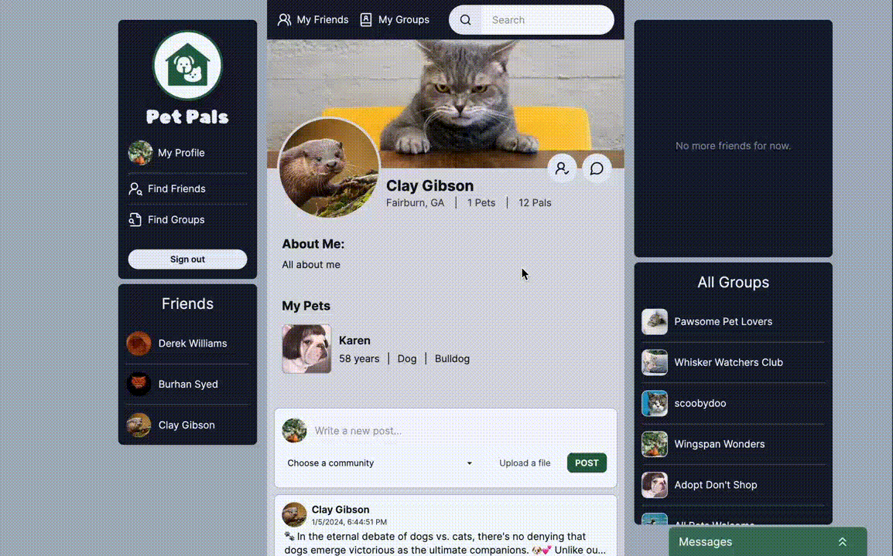
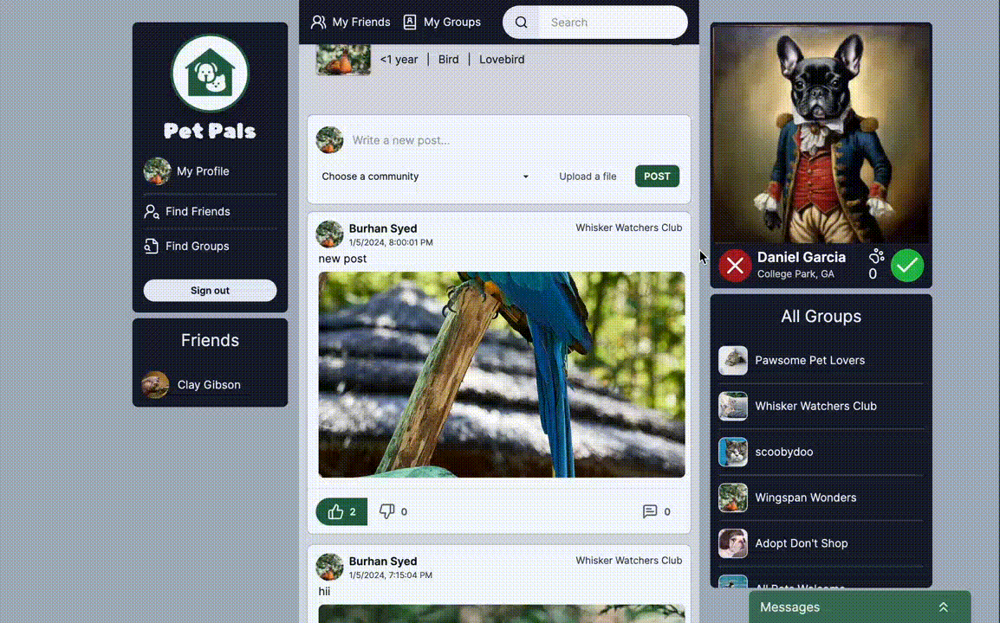

<a id='readme-top'> </a>

<br />
<div align="center">
  <a href="https://github.com/SA-BlueOcean/PetCentral">
    <!-- TODO: Create an LOGO for PetCentral -->
    <!--  -->
  </a>
  <h3 align="center">
    PetCentral
  </h3>
  <p align="center">
      PetCentral is a vibrant and secure community-driven platform designed exclusively for pet owners who share a passion for their furry, feathery, or scaly companions. Whether you're a proud dog parent, a cat enthusiast, or an advocate for more exotic pets, PetCentral is the ultimate destination to meet like-mineded individuals and forge meaningful connections.
      We pride ourselves on not just being an app; we're a commuinity where pet owners come together to celebrate the joys of pet companionship. Join us today, and embark on a journey filled with friendship, shared experiences, and the unconditional love that only pets can provide. Connect, communicate, and create lasting bonds on PetCentral!
    <br />
    <a href="https://github.com/SA-BlueOcean/PetCentral"><strong>Explore the docs »</strong></a>
    <br />
    <br />
    <!-- TODO: After deployed add link HERE   -->
    <a href="#">View Live</a>
    |
    <a href="https://github.com/SA-BlueOcean/PetCentral/issues">Report Bug</a>
    |
    <a href="https://github.com/SA-BlueOcean/PetCentral/issues">Request Feature</a>

  </p>
</div>

<details>
  <summary>Table of Contents</summary>
  <ol>
    <li>
      <a href="#about">About</a>
      <ul>
        <li>
          <a href="#built-with">Built With</a>
        </li>
      </ul>
    </li>
    <li>
      <a href="#getting-started">Getting Started</a>
      <ul>
        <li>
          <a href="#prerequisites">Prerequisites</a>
        </li>
        <li>
          <a href="#installation">Installation</a>
        </li>
      </ul>
    </li>
    <li>
      <a href="#usage">Usage</a>
    </li>
    <li>
      <a href="#roadmap">Roadmap</a>
    </li>
    <li>
      <a href="#optimizations">Optimizations</a>
    </li>
    <li>
      <a href="#lessons-learned">Lessons Learned</a>
    </li>
    <li>
      <a href="#contributing">Contributing</a>
    </li>
    <li>
      <a href="#license">License</a>
    </li>
    <li>
      <a href="#contact">Contact</a>
    </li>
  </ol>
</details>

## About

<div align="center">
    <!-- TODO: Add landing page image -->

  <!--  -->
</div>

<br />
<p>
  PetCentral is a full-stack application that allows users to connect with other pet owners in their area.

Some of our key features are:

  <ul>
    <li>
      Secure Sign-in:  Rest easy knowing that your pet's safety and privacy are our priorities too!
    </li>
    <li>
      <span>Profile Page: Curate your pet's story and your own, showcasing cherished moments and forming connections within our vibrant community of pet enthusiasts!</span>
        
    </li>
     <li>
      Friend-Finding: Discover new friends for both you and your pet! Utilize our advanced friend-finding features to connect with local pet owners!
    </li>
    <li>
      <span>Messaging Platform: Stay connected with fellow pet lovers through our intuitive realtime messaging system.</span>
        
    </li>
     <li>
      Forums: Dive into dedicated forums tailored to your pet's specific needs and characteristics.
    </li>
    <li>
      <span>Posts: Create posts to your profile or a forum with images, vote and comment!</span>
      
    </li>
  </ul>
</p>

### Built With

<!-- TODO Add proper colors for each badge -->


<br />


<p align="right">
  (<a href="#readme-top">back to top</a>)
</p>

## Getting Started

<p>
  Before getting started with PetCentral please ensure that you have a database set up to work with Prisma. We highly recommend <a href="https://supabase.com" target="_blank">Supabase</a>
</p>

### Prerequisites


```sh
npm install npm@latest -g
```


```sh
nvm install --lts
node --version
```

Node version is expected to be v20.10.0 or higher

### Installation

1. Clone the repo
   ```sh
   git clone https://github.com/SA-BlueOcean/PetCentral.git
   ```
1. Install NPM packages
   ```sh
   npm install
   ```
1. Rename `.env.example` to `.env` and fill in the following fields:
   - `DATABASE_URL`
   - `NEXTAUTH_URL`
   - `NEXTAUTH_SECRET` (use `# openssl rand -base64 32` to generate)
   - `GITHUB_CLIENT_ID`
   - `GITHUB_CLIENT_SECRET`
   - `GOOGLE_CLIENT_ID`
   - `GOOGLE_CLIENT_SECRET`
   - `FACEBOOK_CLIENT_ID`
   - `FACEBOOK_CLIENT_SECRET`
   - NEXT_PUBLIC_SUPABASE_URL
   - NEXT_PUBLIC_SUPABASE_ANON_KEY
   - Check NextAuth.js documentation for more information on how to set up OAuth providers
1. Run Prisma generate to generate the Prisma client

```sh
npx prisma generate
```

1. Run the development server

```sh
npm run dev
```

<p align="right">(<a href="#readme-top">back to top</a>)</p>

<!-- ROADMAP -->

## Roadmap

- [x] We did this
- [ ] Then we did that
- [ ] We'll do this next

See the [open issues](https://github.com/SA-BlueOcean/PetCentral/issues) for a
full list of proposed features (and known issues).

<p align="right">(<a href="#readme-top">back to top</a>)</p>

## Optimizations

- Optimizations go here!

## Lessons Learned

- We learned more about how to \_\_\_ here!

<!-- CONTRIBUTING -->

## Contributing

Feel free to join in! Whether its fixing bugs, improving documentation, or
simply spreading the word! Please see
[Contributing Guidelines](/CONTRIBUTING.md) for further guidance. If you require
assistance please don't hesitate to reach out!

<!-- LICENSE -->

## License

Distributed under the MIT License. See [LICENSE](./LICENSE) for more
information.

<!-- CONTACT -->

## Contact

<h3 align='center'> Burhan</h3>
<h4 align='center'>
  <a href="https://www.linkedin.com/in/burhan-syed/">Linkedin</a> |
  <a href="https://www.github.com/burhan-syed">Github</a>
</h4>
<h3 align='center'> Clay</h3>
<h4 align='center'>
  <a href="https://www.linkedin.com/in//">Linkedin</a> |
  <a href="https://www.clay.com/">Portoflio</a> |
  <a href="https://www.twitter.com/">Twitter</a> |
  <a href="https://www.github.com/">Github</a>
</h4>
<h3 align='center'> Derek</h3>
<h4 align='center'>
  <a href="https://www.linkedin.com/in//">Linkedin</a> |
  <a href="https://www.derek.com/">Portoflio</a> |
  <a href="https://www.twitter.com/">Twitter</a> |
  <a href="https://www.github.com/">Github</a>
</h4>
<h3 align='center'> Hazel</h3>
<h4 align='center'>
  <a href="https://www.linkedin.com/in/hazelkimberly/">Linkedin</a> |
  <a href="https://www.github.com/hazelkimberly">Github</a>
</h4>
<h3 align='center'> Mallory</h3>
<h4 align='center'>
  <a href="https://github.com/malloryporche">Github</a> |
  <a href="https://www.linkedin.com/in/mallory-burke/">Linkedin</a> |
  <a href="https://www.malloryburke.com/">Portoflio</a>
</h4>
<h3 align='center'> Ming Lee Ng</h3>
<h4 align='center'>
  <a href="https://github.com/RedconOne">GitHub</a> |
  <a href="https://linkedin.com/in/MingLeeNg">Linkedin</a> |
  <a href="https://minglee.me">Portoflio</a>
</h4>
<h3 align='center'> Thomas Harbert </h3>
<h4 align='center'>
  <a href="https://www.linkedin.com/in/thomasgharbert/">Linkedin</a> |
  <a href="https://github.com/tgharbert">Github</a>
</h4>

<p align="right">(<a href="#readme-top">back to top</a>)</p>

<p> Attribution <p>

<a target="_blank" href="https://icons8.com/icon/NI-py7EAFhDr/animal-shelter">Animal Shelter</a> icon by <a target="_blank" href="https://icons8.com">Icons8</a>
